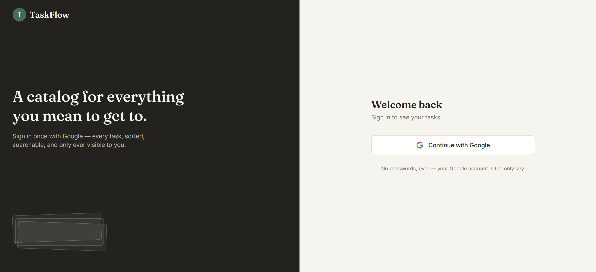
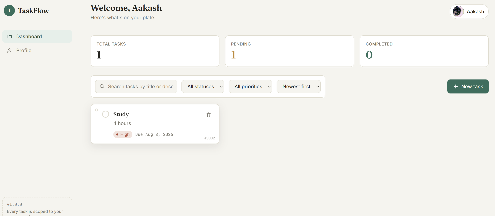
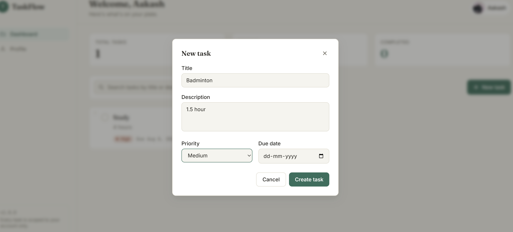
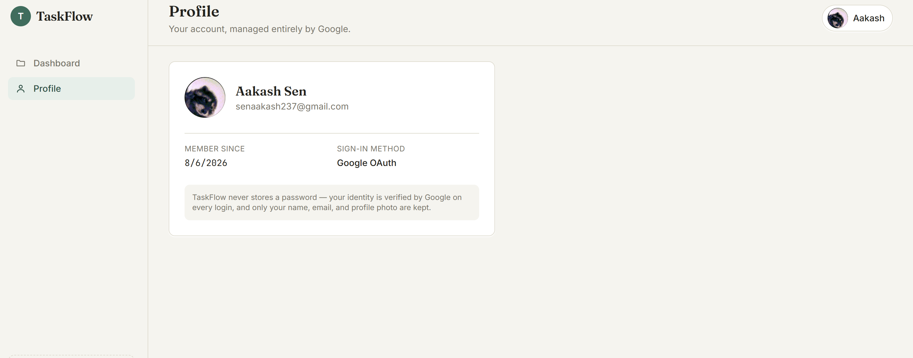

# TaskFlow

A full-stack task management app with Google Sign-In — built to demonstrate real
production patterns (OAuth 2.0 / OIDC, session auth, REST API design, ORM-backed
persistence, per-user data isolation) rather than a bare CRUD tutorial.

**Stack:** React · Vite · Tailwind CSS · Node.js · Express · Prisma · SQLite · Passport.js

---

## Features

- 🔐 **Google OAuth 2.0 + OIDC login** — no passwords stored, ever
- 🍪 **Secure session auth** via HTTP-only cookies (not a JWT sitting in `localStorage`)
- ✅ **Full task CRUD** — create, read, update, delete, toggle complete/pending
- 🔍 **Search, filter, and sort** — by title/description, status, priority, due date
- 🔒 **Per-user data isolation**, enforced at the database query level, not just the UI
- 📊 **Dashboard stats** — total / pending / completed, computed live from the current filter
- 🎨 **A deliberate visual identity** — task cards styled like library catalog cards
  (punch-hole, monospace date stamps) instead of default component-library styling
- 🧱 **Clean MVC backend** — routes / controllers / middleware / services cleanly separated
- 🛡️ **Centralized error handling & input validation** — consistent JSON envelope on every response

---

## Screenshots

<table>
  <tr>
    <td></td>
    <td></td>
    <td></td>
    <td></td>
  </tr>
</table>

## Project structure

```
taskflow/
├── server/                 Express + Prisma + Passport (MVC backend)
│   ├── prisma/
│   │   └── schema.prisma   User + Task models, one-to-many relation
│   └── src/
│       ├── config/         Passport Google strategy, Prisma client singleton
│       ├── controllers/    request/response logic — no raw SQL, no routing
│       ├── middleware/     auth guard, express-validator rules, error handler
│       ├── routes/         "verb + path -> controller", nothing else
│       ├── utils/          ApiError, response envelope, asyncHandler
│       ├── app.js          middleware pipeline + route mounting
│       └── server.js       boots the HTTP server
│
├── client/                 React + Vite + Tailwind (frontend)
│   └── src/
│       ├── components/     Navbar, Sidebar, TaskCard, TaskForm, SearchBar, Modal…
│       ├── pages/          Login, Dashboard, TaskDetails, Profile, NotFound
│       ├── context/        AuthContext — holds the logged-in user app-wide
│       ├── hooks/          useAuth
│       └── services/       api.js (Axios instance), authService.js, taskService.js
│
└── docs/
    └── API.md              full endpoint reference
```

---

## Why this stack

| Layer     | Choice                                   | Why |
|-----------|-------------------------------------------|-----|
| Auth      | Google OAuth 2.0 + OIDC via Passport.js    | No passwords to store, hash, or leak — Google verifies identity, we just trust its signed token. |
| Session   | `express-session` + HTTP-only cookie       | Invisible to JavaScript, so an XSS bug can't steal it — unlike a JWT in `localStorage`. |
| ORM       | Prisma                                     | Type-safe queries, migrations as code, one-line swap from SQLite to Postgres later. |
| Database  | SQLite                                     | Zero setup for local dev; same Prisma code targets Postgres in production. |
| Backend   | Express, MVC layout                        | Clear separation of concerns — easy to extend without routes turning into spaghetti. |
| Frontend  | React + Vite                               | Fast dev server, minimal config, industry-standard tooling. |
| Styling   | Tailwind CSS                               | Utility-first, consistent design tokens, no context-switching to separate CSS files. |

---

## Getting started

### Prerequisites
- Node.js 18+
- A Google Cloud project with an OAuth 2.0 Client ID

### 1. Google OAuth credentials
1. [Google Cloud Console](https://console.cloud.google.com/) → create/select a project.
2. **APIs & Services → OAuth consent screen** → External, add your email as a test user.
3. **APIs & Services → Credentials → Create Credentials → OAuth client ID** → Web application.
   - Authorized redirect URI: `http://localhost:5000/auth/google/callback`
4. Copy the **Client ID** and **Client Secret**.

### 2. Backend

`.env.example` lives inside `server/`, not the repo root — `cd` in first.

```bash
cd server
cp .env.example .env        # Windows PowerShell: copy .env.example .env
# fill in GOOGLE_CLIENT_ID, GOOGLE_CLIENT_SECRET, SESSION_SECRET

npm install
npx prisma generate
npx prisma migrate dev --name init
npm run dev                 # http://localhost:5000
```

### 3. Frontend (new terminal)

```bash
cd client
npm install
npm run dev                 # http://localhost:5173
```

Visit **http://localhost:5173**, click "Continue with Google," and you'll land on the
dashboard.

### 4. Inspect the data (optional)

```bash
cd server
npx prisma studio           # GUI at http://localhost:5555
```

---

## How a request actually flows

1. **Browser → React (`:5173`)** — the UI never talks to the database directly.
2. **React → Express (`:5000`)** via Axios, with `withCredentials: true` so the session
   cookie is sent on every request.
3. **`authMiddleware.js`** checks `req.isAuthenticated()` before letting the request
   reach a controller — no session, `401`.
4. **Controller** parses the request and calls **Prisma** (e.g. `prisma.task.findMany(...)`),
   always scoped with `userId: req.user.id`.
5. **Prisma → SQLite** — Prisma compiles the call into SQL, runs it, returns typed JS objects.
6. Response comes back as `{ success, message, data }`; React updates state.

### The Google OAuth handshake

1. Click "Continue with Google" → browser navigates to `GET /auth/google`.
2. Passport redirects to Google's consent screen.
3. User approves → Google redirects to `GET /auth/google/callback?code=...`.
4. Passport exchanges the one-time `code` for tokens directly with Google (never touches the browser).
5. Passport verifies the token's signature and decodes `googleId`, `email`, `name`, `picture`.
6. `authController` finds-or-creates a `User` row keyed on `googleId`.
7. Passport signs the user's `id` into an encrypted session cookie — never the user's data.
8. Browser redirects to the dashboard; the cookie rides along on every future request.

See [`docs/API.md`](docs/API.md) for the full endpoint reference, and the per-folder
`server/README.md` / `client/README.md` for implementation notes.

---

## Roadmap / possible extensions

- [ ] Deploy (Render/Railway for the API, Vercel/Netlify for the frontend)
- [ ] Swap SQLite → Postgres for production (one line in `schema.prisma`)
- [ ] Add Jest + Supertest coverage for the task endpoints
- [ ] Task tags/labels, recurring tasks, due-date reminders

---

## Troubleshooting

**`localhost:5000` refuses to connect**
The backend crashed or never started — check the terminal running `npm run dev` in `server/`.

**`@prisma/client did not initialize yet`**
Run `npx prisma generate` inside `server/`, then restart. Needed after every fresh
`npm install` and any schema change.

**`cp: cannot find path .env.example`**
`.env.example` exists separately inside `server/` and `client/`, not the repo root —
`cd` into the right folder first.

**Google login redirects to an error page**
Confirm the redirect URI in Google Cloud Console matches `GOOGLE_CALLBACK_URL` in
`server/.env` exactly, and that your account is added as a test user on the consent screen.

---

## License

MIT — free to use as a learning reference or portfolio base.